# pgmutils
Utilities for processing PGM images, for fun and for art.

You can find sample PGM images to operate on in the `inputs/` [directory](/inputs). Note that these utilities are built to operate on uncompressed images. You can use ImageMagick's `convert` utility to decompress: `convert -compress none input.pgm output.pgm` (works with inputs of many file types).

## colorize
Treats an input PGM image (which is black and white) and colorizes it according to a user-specified color palette.

### Usage
```
usage: colorize.py [-h] [-o] [-c  [...] | -f ] [-w] [-i] [-p PIXELATE] image

positional arguments:
  image                 Input PGM image

optional arguments:
  -h, --help            show this help message and exit
  -o , --out            Output postscript file
  -c  [ ...], --colors  [ ...]
                        A color palette for the resultant image, e.g. 'blue
                        #fab123 magenta (255, 4, 12)'
  -f , --file           File containing new-line separated colors for palette
  -w, --watch           Watch the turtle do its magic (slow)
  -i, --invert          Invert the image
  -p PIXELATE, --pixelate PIXELATE
                        Level of pixelation for the image (1-∞)
```

The output graphics are done with the Python Turtle Graphics library, cause I randomly had the idea to do so. Turtle Graphics is pretty slow, so beware that large images with less pixelization (i.e. `-p num`) may take longer to process.

### Dependencies

Python3 modules `matplotlib` and `turtle`

### Examples

`python3 colorize.py doge.pgm --file palettes/doge`

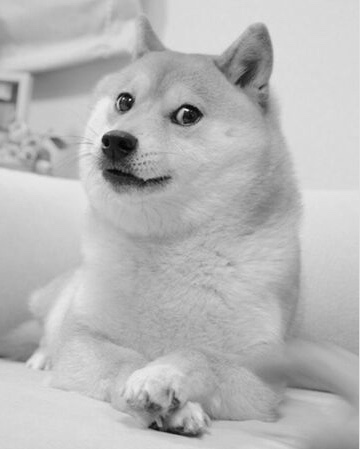


`python3 colorize.py acid.pgm -i --colors blue magenta pink -p 4`


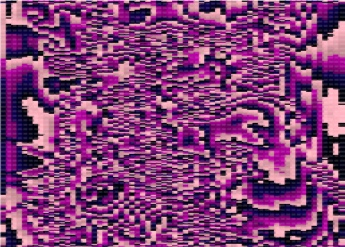

*Any resizing is accidental, all demo images are screenshots*

### Batch Processing
I've also added a shell script that applies each palette from the `palettes/` directory to the input file and creates a PNG file for each. I have more information about that [here](https://github.com/joshnatis/pgmutils/blob/main/colorize/batch/README.md).

---

## eufx
_/yo͞o fəks/_, applies filters to an input PGM image

### Usage
```
./eufx --filter <filter_type> input.pgm output.pgm
```

### Build
1. `git clone https://github.com/joshnatis/pgmutils`
2. `cd eufx/`
2. `make`

### Dependencies
`c++11` and `make`

### Available Filters
```
rotate
asciify
scale_down
scale_up
noise
posterize
nothing
invert
frame
box_blur
gaussian_blur
motion_blur
sobol_edge_detection
horizontal_edge_detection
vertical_edge_detection
45_edge_detection
all_edge_detection
edge_detection_2
sharpen1
sharpen2
deepfry
gridlines
emboss
acid
soundscape
```

### Examples

Originals:


Filtered:

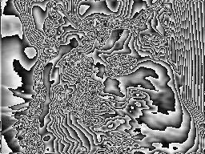
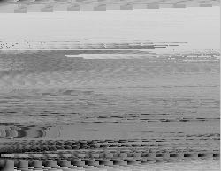
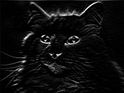
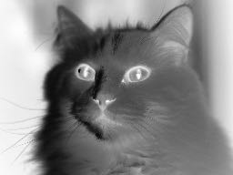

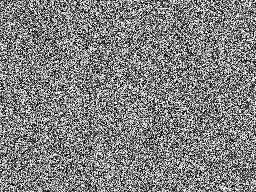
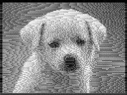
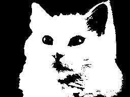
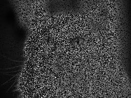
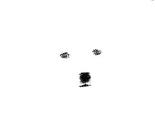
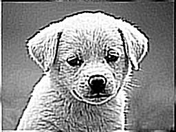
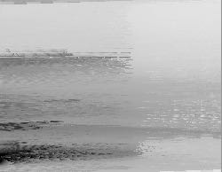

---

## reformat
Reformat a PGM image to my canonical format (rows of values separated by a single space)

### Usage
```
./reformat input.pgm output.pgm
```

### Build
1. `git clone https://github.com/joshnatis/pgmutils`
2. `cd reformat/`
2. `gcc reformat.c -Wall -Wextra -o reformat`

---
