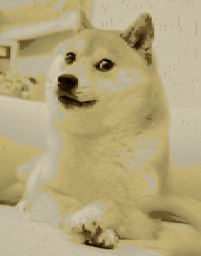

# pgmutils
Utilities for processing PGM images, for fun and for art.

## colorize
Treats an input PGM image (which is black and white) and colorizes it according to a user-specified color palette.

```
usage: colorize.py [-h] [-o] [-c  [...] | -f ] [-w] [-i] [-p PIXELATE] image

positional arguments:
  image                 Input PGM image

optional arguments:
  -h, --help            show this help message and exit
  -o , --out            Output postscript file
  -c  [ ...], --colors  [ ...]
                        A color palette for the resultant image, e.g. 'blue
                        #fab123 magenta (255, 4, 12)'
  -f , --file           File containing new-line separated colors for palette
  -w, --watch           Watch the turtle do its magic (slow)
  -i, --invert          Invert the image
  -p PIXELATE, --pixelate PIXELATE
                        Level of pixelation for the image (1-∞)
```

`python3 colorize.py inputs/doge.pgm --file palettes/doge`




`python3 colorize.py inputs/acid.pgm -i --colors blue magenta pink -p 4`


*Any resizing is accidental, all demo images are screenshots*
